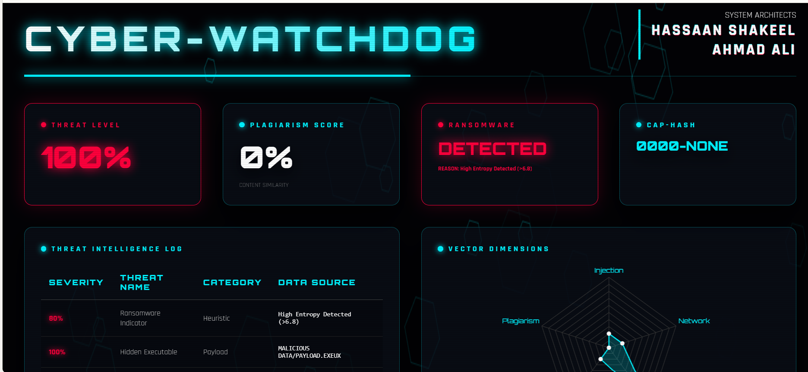

🛡️ Cyber-Watchdog: Omega Protocol

Architect: Hassaan Shakeel
Engine Type: Advanced Static Security & Similarity Intelligence Framework
Core Language: C++

🚀 Overview

Cyber-Watchdog: Omega Protocol is a high-performance C++ security engine engineered for deep forensic analysis and intelligent similarity detection.

It combines heuristic malware pattern recognition with word-level plagiarism analysis powered by the Jaccard Similarity Index, delivering precise and actionable insights.

🖼️ System Preview

  

🛠️ Key Features
🔎 Heuristic Threat Detection

Proactively identifies:

Ransomware indicators

Suspicious code signatures

Malicious pattern anomalies

Static analysis techniques help detect threats before execution.

📊 Plagiarism Analysis Engine

Computes similarity scores using Jaccard Index

Measures edit distance via Levenshtein Algorithm

Detects code duplication and textual content theft

Generates percentage-based similarity reports

🌐 3D HTML Forensic Reporting

Automatically generates a high-fidelity interactive report:

CyberWatchdog_Warfare.html

Features:

Dynamic charts (Chart.js)

Interactive 3D tilt effects (Vanilla-Tilt)

Clean forensic dashboard layout

Browser-compatible visualization

📈 Entropy Depth Mapping

Performs entropy segmentation across:

Header

Code

Data

Overlay

Detects:

Packed executables

Encrypted payload zones

Hidden or obfuscated content

💻 Getting Started
1️⃣ Compilation

Use a C++ compiler such as G++:

g++ CyberWatchdog.cpp -o CyberWatchdog

2️⃣ Execution
./CyberWatchdog

Provide the requested file paths when prompted.

3️⃣ Review Results

After analysis completes, open:

CyberWatchdog_Warfare.html

The generated forensic dashboard will display complete analysis results.

🔧 Technologies Used

Language:
C++

Algorithms:

Jaccard Similarity Index

Levenshtein Distance

DJB2 Hashing

Visualization Stack:

HTML5

CSS3

JavaScript

Chart.js

Vanilla-Tilt.js
